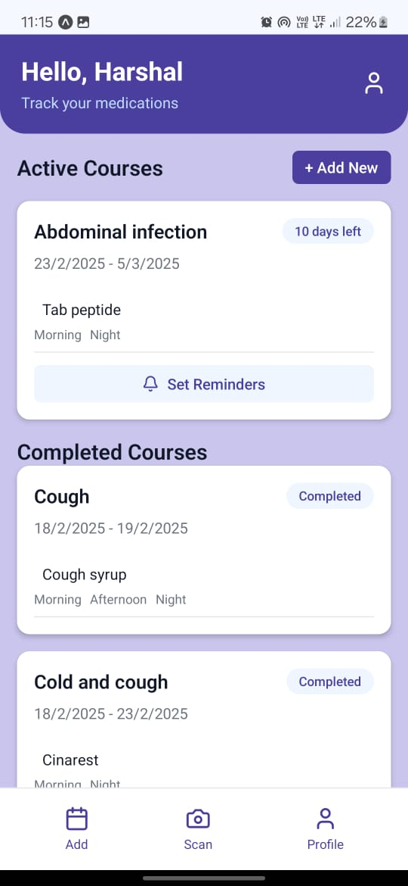
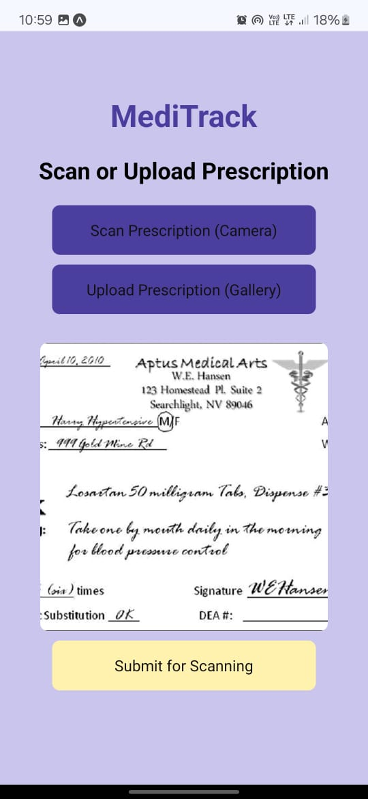
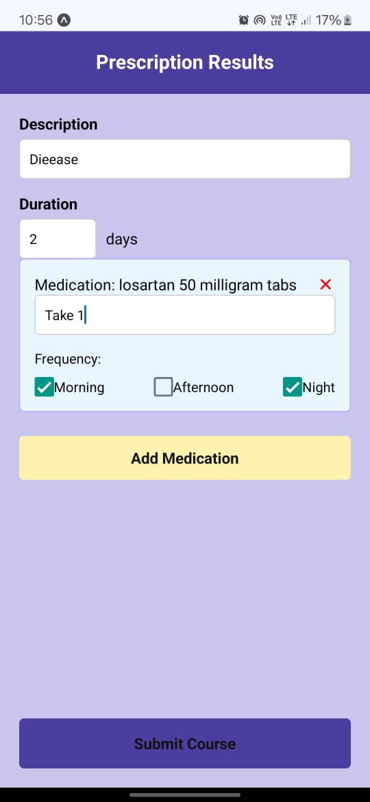
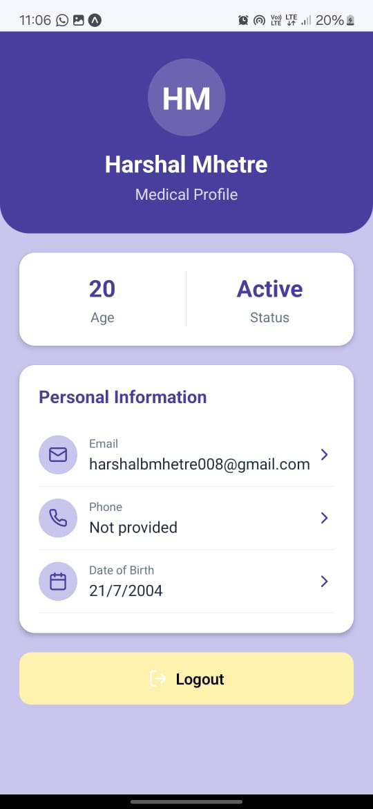

# MediVoice 🩺🗣️

**MediVoice** is an AI-powered mobile application that simplifies how users manage medications by reading prescriptions and setting intelligent reminders. Built using **React Native** and **Node.js**, it leverages **OCR (Optical Character Recognition)** to extract medicine names and provides **voice-based reminders** using Text-to-Speech APIs.

> ✅ Perfect for elderly users, caregivers, and patients needing reliable medication tracking without manual input.

## 📱 Key Features

- **📸 Scan & Recognize:** Upload or capture a prescription image and extract medicine names using OCR
- **🔊 Voice Reminders:** Get automated voice-based reminders at scheduled intervals
- **🆓 Quick Scan Mode:** Use core functionality without login – great for one-time or emergency use
- **🗂️ Subscription Access:** Premium users get advanced features like dosage scheduling, course tracking, and notification-based alerts
- **🔐 Secure Login:** Supports user authentication for personalized tracking and saved prescriptions

## 🧰 Tech Stack

| Layer        | Technology Used                             |
|--------------|----------------------------------------------|
| **Frontend** | React Native (Expo), JavaScript              |
| **Backend**  | Node.js, Express                             |
| **Database** | MongoDB Atlas                                |
| **AI/ML**    | Python (Tesseract OCR), Google TTS API       |
| **Auth**     | JWT-based authentication with Email OTP verification |

## 🖼️ Screenshots

<div align="center">
  <table>
    <tr>
      <td align="center">
        <br>
        <b>Home Screen</b>
      </td>
      <td align="center">
        <br>
        <b>Scan Prescription</b>
      </td>
      <td align="center">
        <br>
        <b>Result Page</b>
      </td>
      <td align="center">
        <br>
        <b>Dashboard</b>
      </td>
    </tr>
  </table>
</div>

## 🛠️ Installation & Setup

### Prerequisites

Before you begin, ensure you have the following installed:

- **Node.js** (v16 or higher) and **npm**
- **Expo CLI**: `npm install -g expo-cli`
- **Python 3.8+** with **Tesseract OCR**
- **MongoDB Atlas** account
- **Google Cloud** account for TTS API
- **Email service** (Nodemailer with Gmail/SendGrid/etc.)

### 📋 Environment Variables

Create the following environment files:


### 🔧 Backend Setup

1. **Clone the repository**
```bash
git clone https://github.com/your-username/medivoice.git
cd medivoice
```

2. **Install backend dependencies**
```bash
cd backend
npm install
```

3. **Install Python dependencies**
```bash
pip install -r requirements.txt
```


5. **MongoDB Atlas Setup**
   - Create a cluster at [MongoDB Atlas](https://cloud.mongodb.com/)
   - Create a database user with read/write permissions
   - Whitelist your IP address (0.0.0.0/0 for development)
   - Copy connection string to `MONGODB_URI` in `.env`


**Option 3: Custom SMTP**
   - Use your domain's SMTP settings
   - Configure SMTP host, port, username, and password

8. **Start the backend server**
```bash
npm start
# or for development
npm run dev
```

The backend server will start on `http://localhost:3000`

### 📱 Frontend Setup

1. **Navigate to frontend directory**
```bash
cd ../frontend
```

2. **Install dependencies**
```bash
npm install
```

3. **Install Expo CLI globally (if not already installed)**
```bash
npm install -g expo-cli
```

4. **Start the Expo development server**
```bash
expo start
```


## 🔒 Security Configuration


### OTP Security
- OTP expires in 10 minutes
- Maximum 3 OTP attempts before lockout
- Rate limiting on OTP requests
- Secure OTP generation using crypto.randomBytes()

### Email Security
- Use app-specific passwords for Gmail
- Implement email templates for professional appearance
- Rate limiting on email sending
- Input validation and sanitization

### Database Security
- Use MongoDB connection with authentication
- Implement proper indexing for performance
- Hash passwords using bcrypt with salt rounds ≥ 12
- Validate all user inputs before database operations


## 📱 Building for Production

### Android
```bash
cd frontend
expo build:android
```

### iOS
```bash
cd frontend
expo build:ios
```

### Environment-specific builds
```bash
# Staging
expo build:android --release-channel staging

# Production
expo build:android --release-channel production
```

